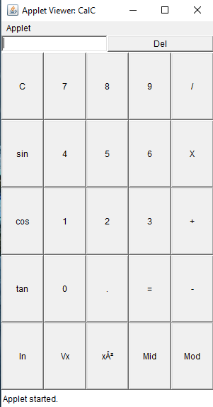

# Basic Calculator
##  Requirements:
* JAVA 1.8
* Works across all Windows Operating System.
## Manual:
### How the Calculator Button Works.
#### Del (Delete) Function
* To clear the last entered digit or function press Del
#### / (Divide) Function
* Enter the Dividend  
* Enter the Divide Sign
* Enter the Divisor
* Press =
#### X (Multiply) Funtion
* Enter the Multiplicand
* Enter the Multiplication Sign
* Enter the Multiplier
* Press =
#### - (Subtraction) Function
* Enter the Number from which the Subtraction will be performed
* Enter the Minus Sign
* Enter the Number to be subtracted
* Press =
#### + (Addition) Function
* Enter the first Number
* Enter the Addition Sum
* Enter the second Number
* Press =
#### Mid (Finding Midpoint of two Numbers) Function
* Enter the either the Upper Limit
* Enter the Mid Sign
* Enter the Lower Limit
* Press =
#### Mod (Modulus) Function
* Enter the Dividend
* Press the Mod function
* Enter the Divisor
#### xA2 (Square) Function
* Enter the Number whose Square you want to find
* Press xA2 button
#### Vx (Square Root) Function
* Enter the Numbber whose Square Root you want to find
* Press Vx button
#### ln (Natural Log) Function
* Enter the number whose Natural Log you want to find
* Press ln button
#### sin (Sine) Function
* Enter the Angle in Degrees
* Press sin
#### cos (Cosine) Function
* Enter the Angle in Degrees
* Press cos
#### tan (Tangent) Function
* Enter the Angle in Degrees
* Press tan
#### C (Clear) Function
* Press Clear Button to delete everything present in the Textbox area
## Preview:

## Contributor:
* 
* [Soham Gon](https://github.com/SOH69)
* [Rijita Bose](https://github.com/r099)
## Owner:
* [Abir Bhattacharya](https://github.com/abirbhattacharya82)
### We made this using JAVA and HTML.. If you find it helpfull do drop a ☆
